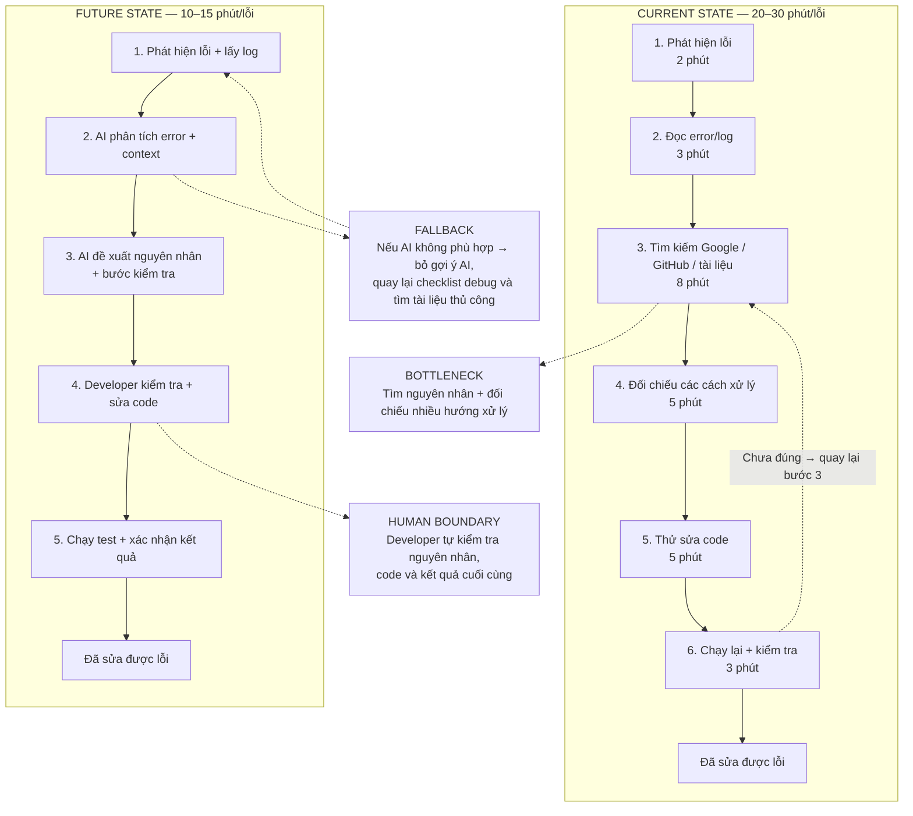
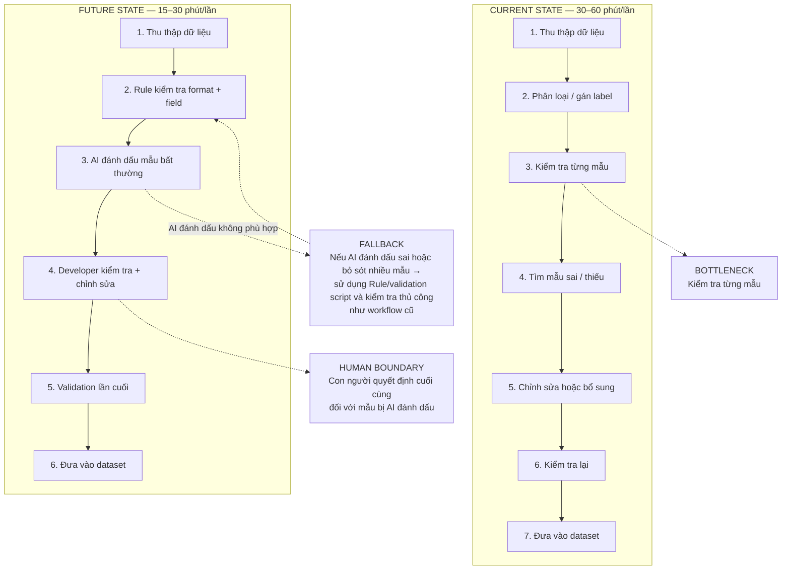
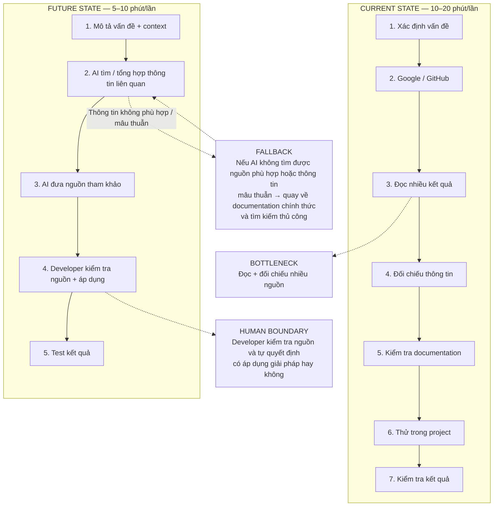

# 01 — Individual Problem Scan

> Điền theo Phase 1 + Phase 2 trong `01-worksheet.md`. Tự scan trước, dùng AI sau để phản biện. Không copy ví dụ Weekly Report.

## Thông tin cá nhân

- Họ và tên: Nguyễn Hoàng Anh
- Mã học viên:2A202602811
- Vai trò / bối cảnh (VD: sinh viên năm X, intern PM, ...):Sinh viên năm 4
- Công việc hằng tuần (3-5 gạch đầu dòng để soi problem):
- Làm bài tập và hoàn thành các bài lab theo deadline.
- Làm đồ án tốt nghiệp, bao gồm lập trình, xử lý dữ liệu và tích hợp AI.
- Tìm kiếm, đọc và tổng hợp tài liệu phục vụ học tập và làm đồ án.
- Làm việc nhóm, trao đổi và thống nhất công việc với các thành viên.
- Kiểm tra, debug và sửa lỗi trong quá trình lập trình.
---

## Phase 1 — Scan 5+ problems (tối thiểu 5, khuyến khích 8-10)

**Cách điền:** mỗi dòng = việc gì + ai chịu + đo bằng gì. Cột `Dấu hiệu thật` bắt buộc có số: mất bao lâu (bấm giờ mấy lần), mấy lần/tuần, bao nhiêu người gặp, log/ticket/quote nào.

| # | Lăng kính (Lặp lại / Tốn thời gian / AI có thể tốt hơn / Pain từ người khác) | Problem quan sát được | Ai chịu ảnh hưởng? | Dấu hiệu thật (số + bằng chứng) |
|---|---|---|---|---|
| 1 | Tốn thời gian | Khi gặp lỗi trong quá trình lập trình, phải tìm kiếm nhiều nguồn và thử nhiều cách trước khi xác định nguyên nhân. | Bản thân | Trung bình gặp khoảng 4–5 lỗi/tuần, mỗi lỗi có thể mất khoảng 20–30 phút để tìm nguyên nhân và sửa. |
| 2 | Lặp lại | Sau mỗi lần thay đổi code, tôi phải chạy lại chương trình và kiểm tra nhiều chức năng để đảm bảo thay đổi mới không làm hỏng phần cũ. | Bản thân | Khoảng 5–7 lần/tuần phải kiểm tra lại sau khi sửa code, mỗi lần mất khoảng 10–15 phút. |
| 3 | Tốn thời gian | Khi gặp vấn đề kỹ thuật, tôi thường phải tìm lại thông tin từ nhiều nguồn như tài liệu, Google, GitHub hoặc các cuộc trao đổi trước đó. | Bản thân | Khoảng 3–5 lần/tuần, mỗi lần tìm kiếm và đối chiếu thông tin mất khoảng 10–20 phút. |
| 4 | AI có thể tốt hơn | Khi đọc tài liệu kỹ thuật dài, tôi phải tự lọc những phần liên quan trực tiếp đến vấn đề đang giải quyết. | Bản thân | Mỗi tuần đọc khoảng 2–3 tài liệu dài, thường mất 30–60 phút/tài liệu để tìm và tổng hợp phần cần thiết. |
| 5 | Lặp lại | Khi xây dựng và chuẩn bị dữ liệu cho đồ án, tôi phải kiểm tra, chỉnh sửa và bổ sung dữ liệu theo từng nhóm trước khi đưa vào model. | Bản thân / nhóm đồ án | Công việc xử lý dữ liệu được thực hiện nhiều lần trong tuần, mỗi lần có thể mất 30–60 phút tùy lượng dữ liệu cần kiểm tra. |
| 6 | Tốn thời gian | Khi project có nhiều thành phần, tôi phải kiểm tra lại cách backend, frontend, database và các model AI kết nối với nhau khi debug hoặc tích hợp chức năng. | Bản thân / nhóm đồ án | Khi tích hợp hoặc sửa chức năng có liên quan nhiều thành phần, tôi thường mất khoảng 15–30 phút/lần để kiểm tra luồng dữ liệu và xác định vị trí lỗi. |
| 7 | Pain từ người khác | Khi làm việc nhóm, thông tin về công việc và tiến độ nằm ở nhiều cuộc trao đổi nên đôi khi thành viên phải hỏi lại nội dung hoặc trạng thái task. | Các thành viên trong nhóm | Trong quá trình làm nhóm, có khoảng 1–3 lần/tuần phải hỏi lại về task, tiến độ hoặc nội dung đã thống nhất. |
| 8 | Tốn thời gian | Khi chuẩn bị bài hoặc tài liệu để nộp, tôi phải kiểm tra lại nhiều yêu cầu để tránh thiếu nội dung hoặc sai format. | Bản thân | Mỗi bài/tài liệu thường phải kiểm tra lại 1–2 lần trước khi nộp, mỗi lần mất khoảng 10–20 phút. |
| 9 | AI có thể tốt hơn | Khi học một chủ đề kỹ thuật mới, tôi phải kết hợp nhiều nguồn để hiểu khái niệm và tìm cách áp dụng vào code thực tế. | Bản thân | Mỗi tuần có khoảng 1–2 chủ đề mới cần tìm hiểu, mỗi chủ đề có thể mất 30–90 phút để đọc, đối chiếu và thử nghiệm. |
| 10 | Lặp lại | Sau khi hoàn thành một phần code hoặc dữ liệu, tôi phải kiểm tra kết quả nhiều lần trước khi commit hoặc chuyển sang phần tiếp theo. | Bản thân / nhóm đồ án | Khoảng 3–5 lần/tuần thực hiện kiểm tra trước khi commit hoặc tích hợp, mỗi lần mất khoảng 10–20 phút. |

> Gợi ý tự soi: tuần trước mất nhiều thời gian nhất vào việc gì? Việc gì hay trì hoãn? Người khác hay hỏi lại câu gì? Workflow nào ai cũng biết là chậm?

**AI đã dùng ở Phase 1 (nếu có):**
- Prompt đã hỏi: Chưa sử dụng AI để tạo problem ban đầu. Tôi tự rà soát các công việc học tập, lập trình, làm đồ án và làm việc nhóm trước, sau đó mới dùng AI để kiểm tra và phản biện danh sách problem.
- Ý dùng được: AI giúp tôi nhìn thêm một số góc độ như việc tìm lại tài liệu, kiểm tra code sau khi sửa và xử lý dữ liệu lặp lại. Tôi giữ lại những ý có workflow cụ thể và có thể xác định được người gặp vấn đề, thời gian hoặc tần suất.
- Ý bỏ vì không phải pain thật: Tôi bỏ các ý tưởng quá rộng như xây một AI assistant quản lý toàn bộ việc học hoặc tự động hóa toàn bộ đồ án vì chưa xác định được bottleneck cụ thể và chưa có bằng chứng cho thấy đó là vấn đề thực sự.

**Self-check Phase 1:**
- [x] Đủ 5+ dòng, mỗi dòng có actor + số đo cụ thể
- [x] Dùng ít nhất 3/4 lăng kính
- [x] Không có dòng chung chung kiểu "mất nhiều thời gian"

---

## Phase 2 — Top 3 Problem Cards

### 2.1. Chọn top 3

Giữ bài nào: actor cụ thể, workflow vẽ được 3-7 bước, bottleneck ở 1 bước, impact đo được. Loại bài quá rộng.

| Rank | Problem (copy từ bảng scan) | Vì sao chọn (2-3 ý) | Điều còn chưa chắc |
|---|---|---|---|
| 1 | Khi gặp lỗi trong quá trình lập trình, phải tìm kiếm nhiều nguồn và thử nhiều cách trước khi xác định nguyên nhân. | Xảy ra thường xuyên trong quá trình học tập và làm đồ án. Thời gian xử lý mỗi lỗi tương đối lớn và workflow từ phát hiện lỗi → tìm nguyên nhân → thử cách sửa → kiểm tra lại khá rõ. | Chưa xác định chính xác tỷ lệ lỗi mà AI có thể hỗ trợ giải quyết thành công và mức độ giảm thời gian thực tế. |
| 2 | Khi xây dựng và chuẩn bị dữ liệu cho đồ án, phải kiểm tra, chỉnh sửa và bổ sung dữ liệu theo từng nhóm trước khi đưa vào model. | Đây là công việc lặp lại và có nhiều bước xử lý thủ công. Có thể đo số lượng dữ liệu, thời gian xử lý và tỷ lệ dữ liệu cần chỉnh sửa. | Chưa xác định bước nào thực sự là bottleneck lớn nhất và phần nào có thể tự động hóa bằng Rule thay vì AI. |
| 3 | Khi gặp vấn đề kỹ thuật, thường phải tìm lại thông tin từ nhiều nguồn như tài liệu, Google, GitHub hoặc các cuộc trao đổi trước đó. | Xảy ra nhiều lần trong quá trình học và lập trình. Workflow tìm kiếm → đọc → đối chiếu → thử nghiệm có thể đo thời gian và có khả năng sử dụng AI để hỗ trợ tổng hợp thông tin. | Chưa rõ vấn đề chính nằm ở việc tìm kiếm thông tin hay ở việc đánh giá thông tin nào phù hợp với context của project. |

### 2.2. Problem Cards chi tiết (lặp lại cho cả 3 cards)

---

#### Problem Card #1 — [Tên problem]

```text
Problem 1 câu: Khi gặp lỗi trong quá trình lập trình, tôi phải tìm kiếm nhiều nguồn và thử nhiều cách trước khi xác định được nguyên nhân và cách sửa phù hợp.

Actor: Sinh viên tự phát triển và debug các project lập trình/đồ án.

Thời điểm / bối cảnh: Trong quá trình lập trình, đặc biệt khi tích hợp nhiều thành phần hoặc sau khi thay đổi code.

Current workflow 3-7 bước:
1.Chạy chương trình và phát hiện lỗi.
2.Đọc error message/log để xác định vấn đề.
3.Tìm kiếm nguyên nhân trên Google, tài liệu hoặc GitHub.
4.Đọc và so sánh các cách xử lý.
5.Thử sửa code theo một hoặc nhiều hướng.
6.Chạy lại chương trình để kiểm tra.
7.Nếu chưa đúng, quay lại bước tìm nguyên nhân.

Bottleneck: Bước tìm nguyên nhân và lựa chọn cách sửa phù hợp mất nhiều thời gian do phải đọc nhiều nguồn và thử nghiệm nhiều hướng.

Impact: Trung bình gặp khoảng 4–5 lỗi/tuần, mỗi lỗi có thể mất khoảng 20–30 phút để tìm nguyên nhân và sửa. Khi lỗi liên quan đến nhiều thành phần, thời gian debug có thể tăng thêm.

Success metric: Giảm thời gian debug trung bình từ khoảng 20–30 phút/lỗi xuống dưới 10–15 phút/lỗi, đồng thời không làm tăng số lỗi phát sinh sau khi sửa.

Non-AI alternative: Chuẩn hóa quy trình debug bằng checklist: đọc log → xác định file liên quan → kiểm tra input/output → kiểm tra dependency → test lại. Có thể bổ sung tài liệu troubleshooting cho các lỗi thường gặp.

AI hypothesis: AI phân tích error message, đoạn code và context liên quan để gợi ý nguyên nhân có khả năng xảy ra và các bước kiểm tra tiếp theo. Người lập trình vẫn tự kiểm tra và quyết định cách sửa.

Quick gut:
[ ] No AI / process fix
[ ] Rule
[x] Workflow
[ ] Agent
[ ] Chưa biết
```

**Draft workflow Card #1** (ASCII / Mermaid / ảnh đính kèm):




---

#### Problem Card #2 — [Tên problem]

```text
Problem 1 câu: Khi xây dựng và chuẩn bị dữ liệu cho đồ án, tôi phải kiểm tra, chỉnh sửa và bổ sung dữ liệu theo từng nhóm trước khi đưa vào model.

Actor: Sinh viên phụ trách xây dựng và chuẩn bị dataset cho đồ án.

Thời điểm / bối cảnh: Trong quá trình thu thập, làm sạch, bổ sung và chuẩn bị dữ liệu trước khi train hoặc cập nhật model.

Current workflow 3-7 bước:
1.Thu thập hoặc tạo dữ liệu.
2.Phân loại dữ liệu theo nhóm/label.
3.Kiểm tra nội dung từng mẫu.
4.Phát hiện dữ liệu thiếu, sai hoặc không phù hợp.
5.Chỉnh sửa hoặc bổ sung dữ liệu.
6.Kiểm tra lại dữ liệu sau chỉnh sửa.
7.Đưa dataset vào bước tiếp theo.

Bottleneck: Bước kiểm tra và chỉnh sửa từng mẫu dữ liệu mất nhiều công sức vì phải thực hiện lặp lại trên nhiều mẫu.

Impact: Công việc xử lý dữ liệu được thực hiện nhiều lần trong tuần, mỗi lần có thể mất khoảng 30–60 phút tùy lượng dữ liệu cần kiểm tra.

Success metric: Giảm ít nhất 30–50% thời gian kiểm tra và làm sạch dữ liệu, đồng thời giữ tỷ lệ dữ liệu sai/không phù hợp sau kiểm tra ở mức chấp nhận được.

Non-AI alternative: Dùng Rule/validation script để kiểm tra format, trường bắt buộc, độ dài, label hợp lệ và các điều kiện có thể xác định bằng quy tắc.

AI hypothesis: AI hỗ trợ phát hiện các mẫu dữ liệu có nội dung bất thường, trùng ý, sai ngữ cảnh hoặc có khả năng gán nhãn chưa phù hợp. Những mẫu được AI đánh dấu sẽ được con người kiểm tra trước khi đưa vào dataset.

Quick gut:
[ ] No AI / process fix
[x] Rule
[x] Workflow
[ ] Agent
[ ] Chưa biết
```

**Draft workflow Card #2:**




---

#### Problem Card #3 — [Tên problem]

```text
Problem 1 câu: Khi gặp vấn đề kỹ thuật, tôi phải tìm kiếm và đối chiếu thông tin từ nhiều nguồn trước khi xác định được cách xử lý phù hợp với project.

Actor: Sinh viên lập trình và làm đồ án.

Thời điểm / bối cảnh: Khi gặp một lỗi hoặc cần học một công nghệ/thư viện mới để tiếp tục phát triển project.

Current workflow 3-7 bước:
1.Xác định vấn đề cần tìm hiểu.
2.Tìm kiếm trên Google hoặc GitHub.
3.Mở nhiều kết quả và đọc nội dung.
4.So sánh các cách giải quyết.
5.Kiểm tra tài liệu chính thức nếu cần.
6.Thử áp dụng vào project.
7.Kiểm tra kết quả và quay lại tìm kiếm nếu chưa phù hợp.

Bottleneck: Việc đọc và đối chiếu nhiều nguồn để xác định thông tin nào phù hợp với phiên bản, framework và context của project.

Impact: Khoảng 3–5 lần/tuần phải tìm kiếm thông tin kỹ thuật, mỗi lần mất khoảng 10–20 phút để tìm và đối chiếu.

Success metric: Giảm thời gian tìm và tổng hợp thông tin từ khoảng 10–20 phút xuống dưới 5–10 phút/lần, nhưng vẫn giữ được khả năng kiểm tra nguồn gốc thông tin.

Non-AI alternative: Tổ chức bookmark, tài liệu kỹ thuật và troubleshooting notes theo project; xây dựng knowledge base cá nhân.

AI hypothesis: AI hỗ trợ hiểu câu hỏi, lọc và tổng hợp các thông tin liên quan đến vấn đề đang gặp, đồng thời chỉ ra nguồn để người dùng kiểm tra.

Quick gut:
[ ] No AI / process fix
[ ] Rule
[x] Workflow
[ ] Agent
[ ] Chưa biết
```

**Draft workflow Card #3:**



---

### 2.3. Card muốn pitch nhất (chuẩn bị 2 phút)

**Card tôi muốn pitch nhất:**

```text
Card #1 — Debug lỗi lập trình
```

**Vì sao (2-3 câu: workflow gì, số đo gì, impact gì):**

```text
Workflow từ phát hiện lỗi → đọc log → tìm kiếm/đối chiếu → thử sửa → kiểm tra lại khá rõ và có bottleneck cụ thể. Vấn đề xảy ra khoảng 4–5 lỗi/tuần, mỗi lỗi mất khoảng 20–30 phút nên có thể đo được thời gian trước và sau khi cải thiện. AI có thể hỗ trợ phân tích nguyên nhân và hướng kiểm tra, trong khi developer vẫn giữ quyền quyết định cách sửa.
```

**Câu hỏi tôi muốn nhóm challenge (1-2 câu hỏi đúng chỗ yếu):**

```text
Bottleneck thực sự nằm ở việc tìm nguyên nhân hay ở bước thử sửa và kiểm tra lại? Nếu dùng checklist debug không cần AI thì có thể giải quyết phần lớn vấn đề này không?
```

**AI phản biện Card (nếu có):**
- Điểm yếu AI chỉ ra: AI có thể đưa ra cách sửa nghe hợp lý nhưng không phù hợp với context, phiên bản thư viện hoặc cấu trúc project. Ngoài ra, chưa có bằng chứng thực tế cho thấy AI giúp giảm thời gian debug.
- Tôi sửa gì: Giới hạn AI ở việc phân tích error/context và gợi ý nguyên nhân hoặc bước kiểm tra, không cho AI tự sửa hoặc tự quyết định. Bổ sung human boundary và fallback bằng checklist debug + tài liệu thủ công.

### Self-check nộp phần 01
- [x] Có 5+ problems + top 3 Cards đủ field
- [x] Mỗi Card có workflow trước/sau + bottleneck + metric + fallback
- [x] Đã chọn 1 card pitch + câu hỏi challenge
